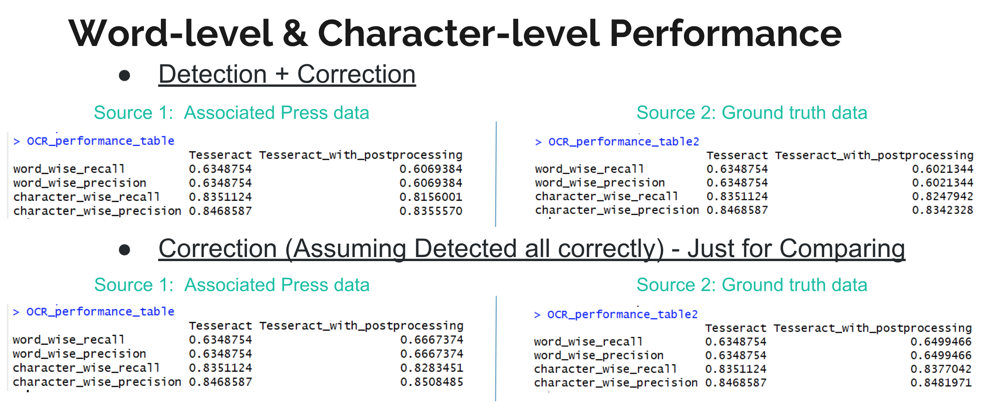

# Project: OCR (Optical Character Recognition) 


### [Full Project Description](doc/project4_desc.md)

Term: Fall 2018

+ Team # 4
+ Team members
	+ Anke Xu
	+ Binglun Zhao
	+ Huiyu Zhang
	+ Jiansong Chen
	+ Sen Fu
	


+ Project summary: In this project, we created an OCR post-processing procedure to enhance Tesseract OCR output. The fisrt step is detecting garbage out from the OCR output by extracting features and building/training SVM models to predict the garbage label for all tokens. Then second step is finding different kinds of transformated candicate words based on the nearby characters within each word and then scoring each candicate word by the Bayesian combination rule Pr(c)Pr(t|c), which depends on the corpus and matrices we generated.
	
**Contribution statement**: All team members contributed equally in all stages of this project. All team members approve our work presented in this GitHub repository including this contributions statement. 

+ Anke Xu:
+ Binglun Zhao: Word list tokenize;Features extraction;Construct labels of words in tesseract outputs 
+ Huiyu Zhang:
+ Jiansong Chen:
+ Sen Fu: Classify Data;Check SVM Algo Parameters by using 10-fold cross validation;SVM model training

Following [suggestions](http://nicercode.github.io/blog/2013-04-05-projects/) by [RICH FITZJOHN](http://nicercode.github.io/about/#Team) (@richfitz). This folder is orgarnized as follows.

```
proj/
├── lib/
├── data/
├── doc/
├── figs/
└── output/
```

Please see each subfolder for a README file.
